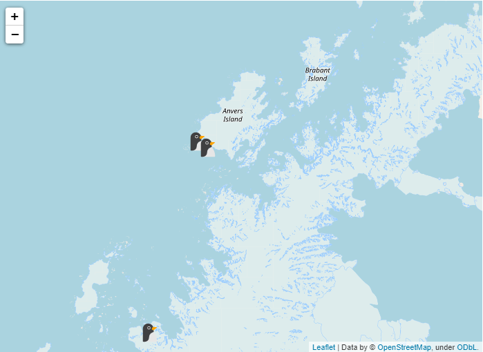

# CORE-project-penguins


## Table of Contents

* [🐧 About The Project](#about-the-project)
* [Prerequisites](#prerequisites)
* [Folder Structure](#folder-structure)
* [💾 Dataset](#dataset)
* [Look inside](#look-inside)
* [📚  References](#references)

## 🐧 About The Project <a name="about-the-project"></a>

CORE-project-penguins es mi primer proyecto de CORE. Consiste en una API que hace peticiones a una base de datos con información sobre los pingüinos del archipiélago de Palmer y devuelve el resultado en un dashboard de Streamlit. 

## Prerequisites 

[](https://www.python.org/)

[](https://open.vscode.dev/silconari/core-project-penguins-)


Los siguientes paquetes de código abierto se han usado en este proyecto:

* Pandas
* Mongo DB
* Altair 
* Streamlit 
* json 
* Flask 
* dotenv
* Folium 


## Folder Structure 

``` 

├── LICENSE
├── README.md
├── assets
│  
├── data
│   ├── new_db.csv
│   └── penguins_lter.csv
├── requirements.txt
└── src
    ├── app.py
    ├── config.py
    ├── controllers
    │   ├── __init__.py
    │   └── root_controllers.py
    ├── jupyter-notebook
    │   ├── creating_df.ipynb
    │   └── db_mongo_connect.ipynb
    ├── main.py
    ├── server.py
    ├── streamlit_dashboard
    │   ├── islands.py
    │   ├── multipage.py
    │   └── penguins.py
    ├── to_new_db.py
    └── utils
        ├── handle_error.py
        ├── json_response.py
        └── mongo_connect.py
```

## 💾 Dataset <a name="dataset"></a>

[Penguins Palmer dataset]("https://www.kaggle.com/parulpandey/palmer-archipelago-antarctica-penguin-data") 🐧


## Look inside 

Gráficas realizadas a partir de los datos del dataset.

Fecha de la puesta de los pingüinos:


Comparativas de la longitud del pico en las diferentes especies:


Marcadores con las islas del archipiélago:



## 📚  References <a name="references"></a>

* Horst AM, Hill AP, Gorman KB (2020). palmerpenguins: Palmer Archipelago (Antarctica) penguin data. R package version  0.1.0. https://allisonhorst.github.io/palmerpenguins/. doi: 10.5281/zenodo.3960218. 
   