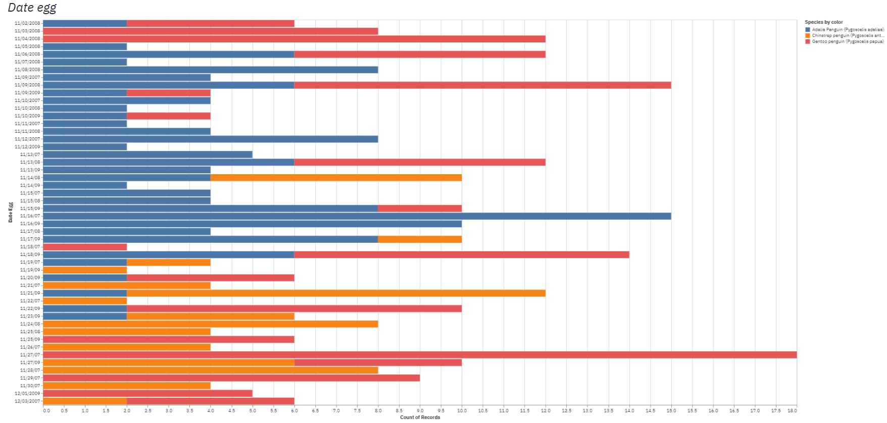
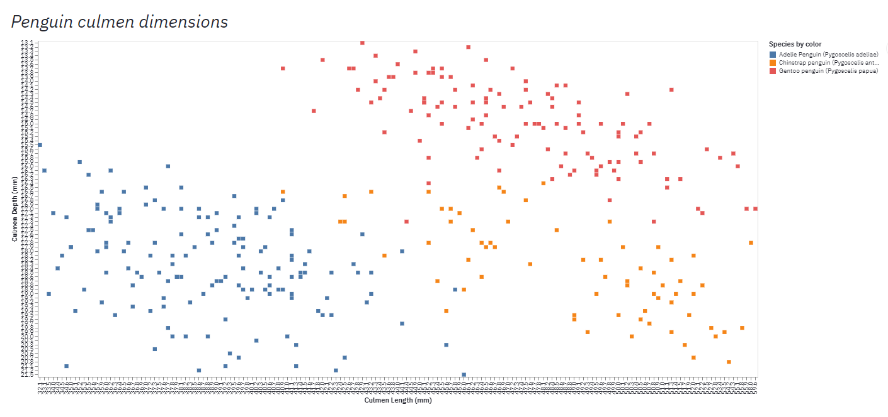

# CORE-project-penguins


## 🐧 About The Project 

CORE-project-penguins es mi primer proyecto de CORE. Consiste en una API que hace peticiones a una base de datos con información sobre los pingüinos del archipiélago de Palmer y devuelve el resultado en un dashboard de Streamlit. 

## Table of Contents 

- * [1. About the project](#1)
  * [2 Purpose](#11)
  * [3 Prerequisites](#12)
  * [4 Folder structure](#13)
  * [5 Dataset](#14-references)
  * [6 Look inside](#15)
  * [7 References](#16)


## Prerequisites 

[](https://www.python.org/)

[](https://open.vscode.dev/Naereen/badges)


Los siguientes paquetes de código abierto se han usado en este proyecto:

* Pandas
* Altair 
* Streamlit 
* json 
* Flask 
* dotenv

## Folder Structure 

``` 

├── LICENSE
├── README.md
├── assets
│  
├── data
│   ├── new_db.csv
│   └── penguins_lter.csv
├── requirements.txt
└── src
    ├── app.py
    ├── config.py
    ├── controllers
    │   ├── __init__.py
    │   └── root_controllers.py
    ├── jupyter-notebook
    │   ├── creating_df.ipynb
    │   └── db_mongo_connect.ipynb
    ├── main.py
    ├── server.py
    ├── streamlit_dashboard
    │   ├── islands.py
    │   ├── multipage.py
    │   └── penguins.py
    ├── to_new_db.py
    └── utils
        ├── handle_error.py
        ├── json_response.py
        └── mongo_connect.py
```

## 💾 Dataset

[(https://www.kaggle.com/parulpandey/palmer-archipelago-antarctica-penguin-data)] 🐧


## Look inside 





## 📚  References

* Horst AM, Hill AP, Gorman KB (2020). palmerpenguins: Palmer Archipelago (Antarctica) penguin data. R package version  0.1.0. https://allisonhorst.github.io/palmerpenguins/. doi: 10.5281/zenodo.3960218. 
   